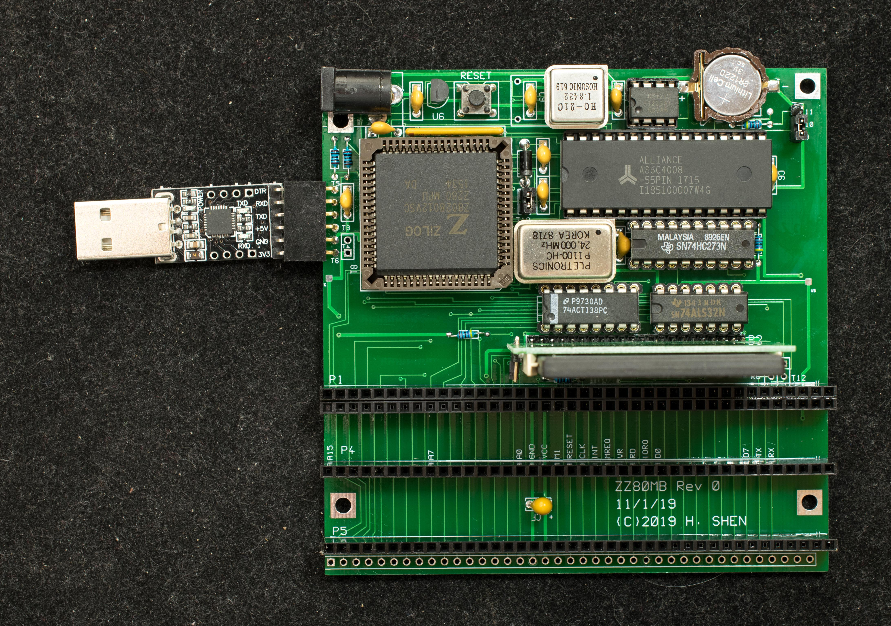
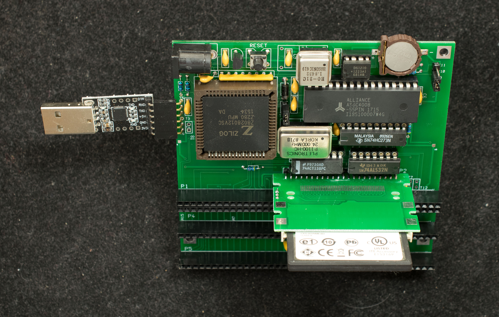

# ZZ80MB Rev0, A Z280-based Motherboard with RC2014 Expansion (Obsolete)
### Introduction
**Please note, this is rev0 of ZZ80MB, it is superceded by [ZZ80MB rev3](..Rev3).**

ZZ80MB is a Z280-based motherboard with RC2014 expansion slots. It is based on the ZZ80RC-CF design, but with additional expansion slots added.

### Features
- Z280 CPU configured to Z80-compatible mode running at 24MHz with selectable bus speed of 12 MHzor 6 MHz
- 1/2 megbyte of non-volatile RAM
- RAM-only system, programs are loaded into the non-volatile RAM in UART-bootstrap mode.
- CP/M 2.2 and CP/M 3 ready.
- CF interface supports 4 CF drives
- 3 RC2014 expansion slots
- One internal UART at 115200 baud, odd parity, no handshake
- bootstrap to ZZ80Mon, a simple monitor
- A standalone single-board computer with I/O expansion bus compatible with RC2014 I/O bus

### Design Information
- [Schematic](zz80mb_r0_scm.pdf)
- [Gerber photoplots](zz80mb_r0.zip)
- Bill of Materials

### Software
- ZZ80Mon, a simple monitor for ZZ80MB
- CP/M2.2 BIOS/BDOS/CCP
