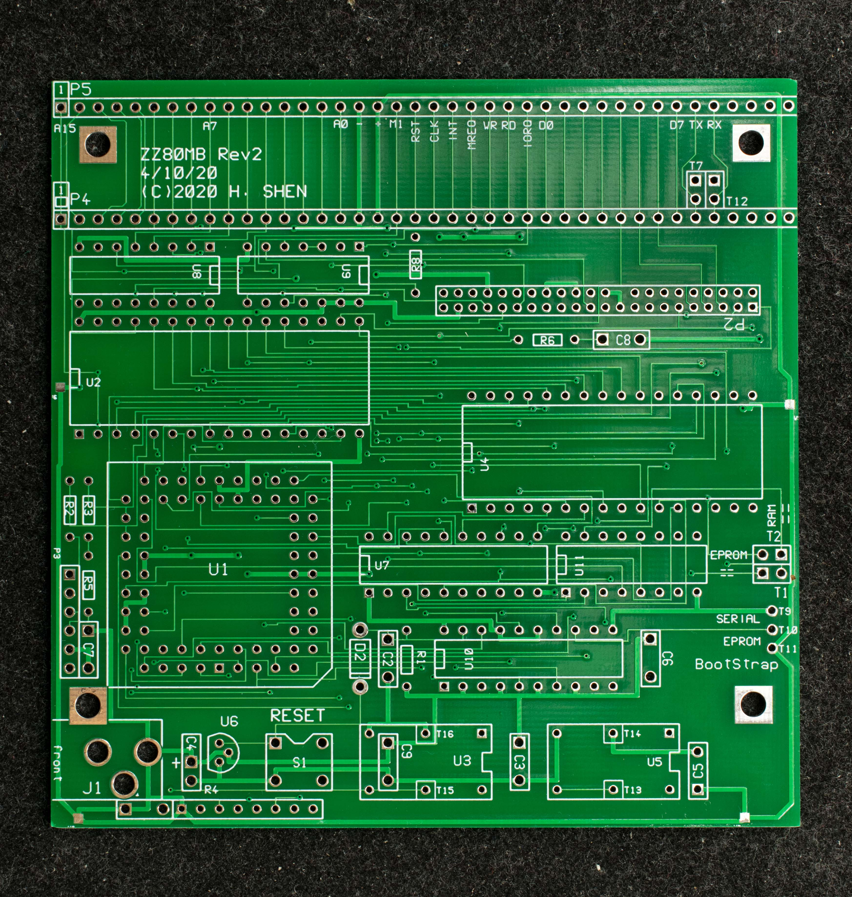
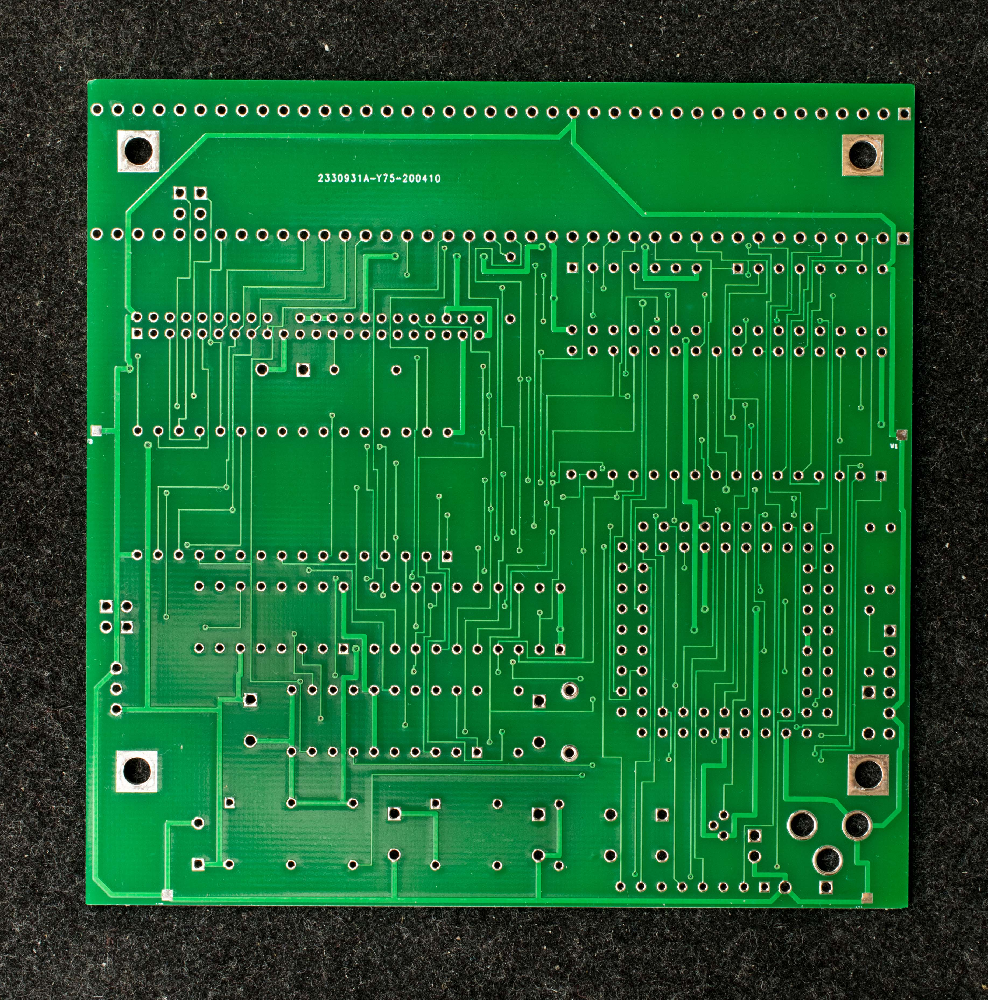
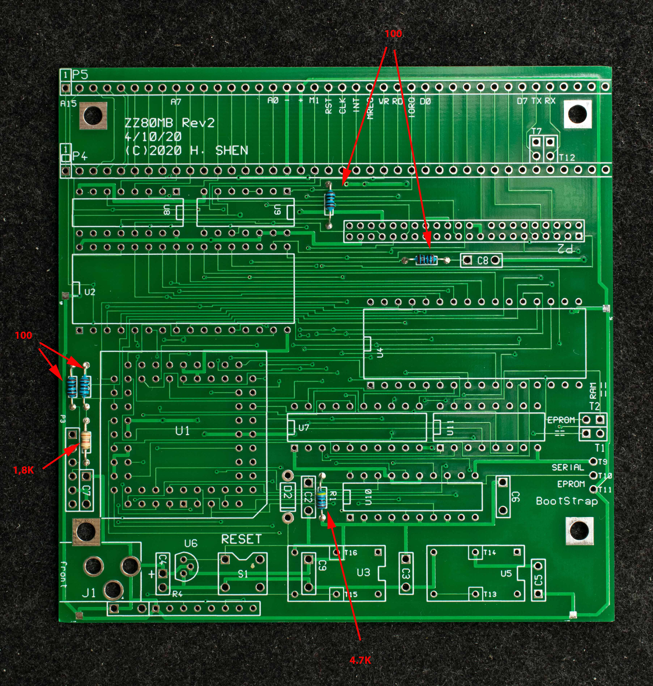
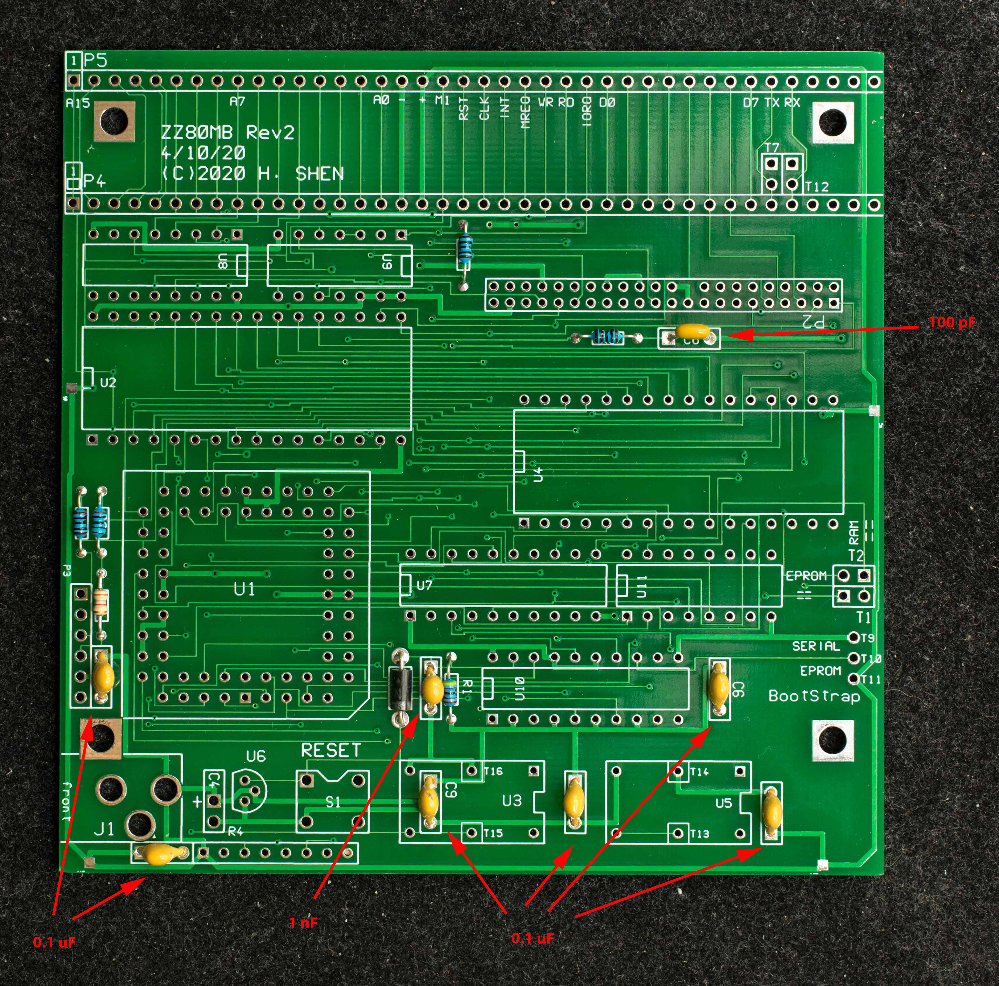
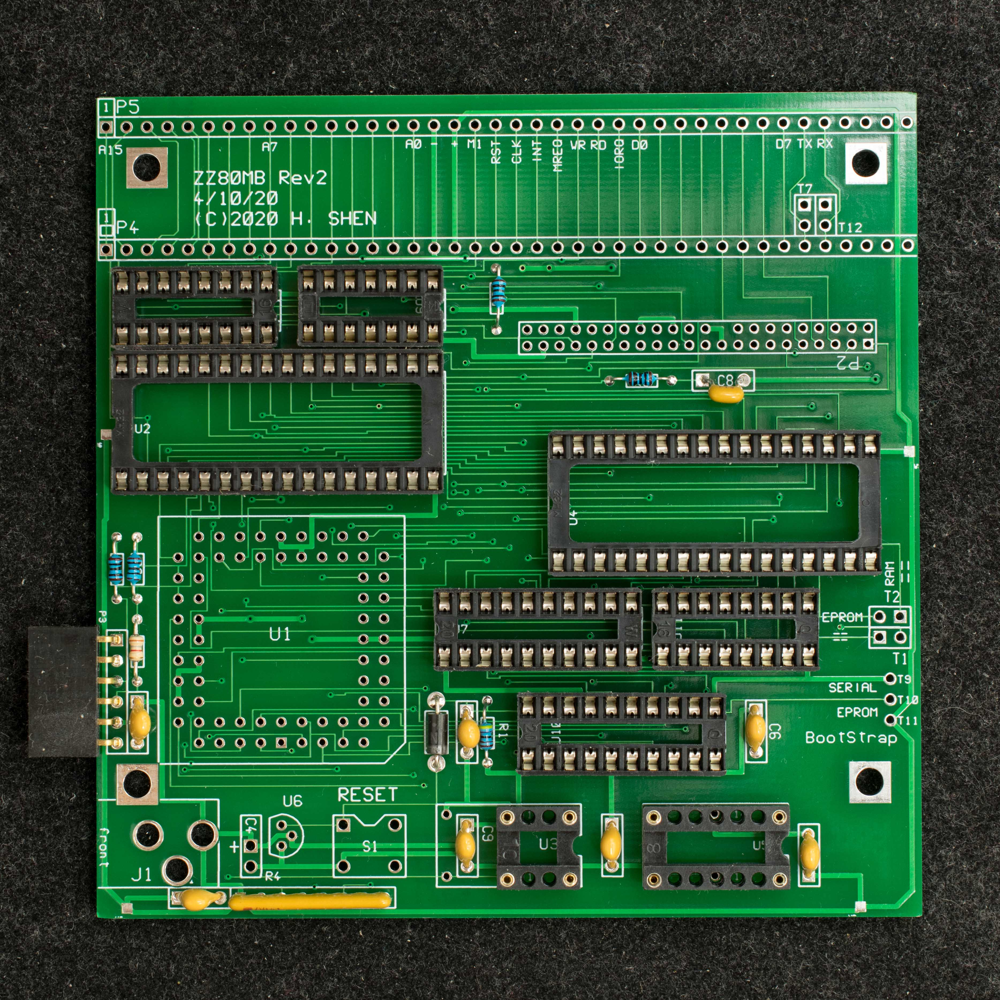
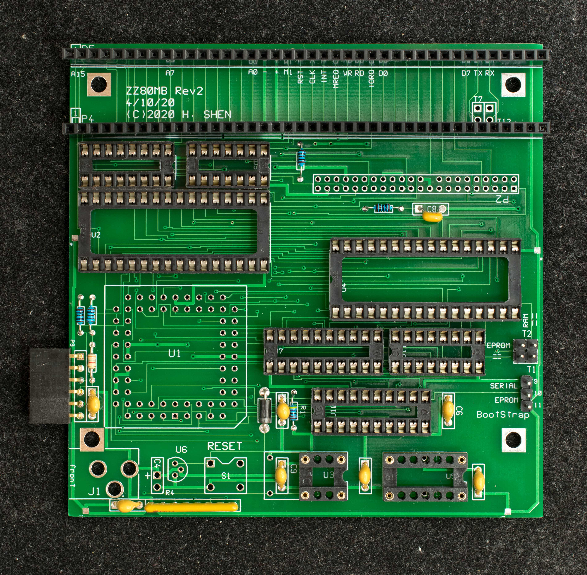
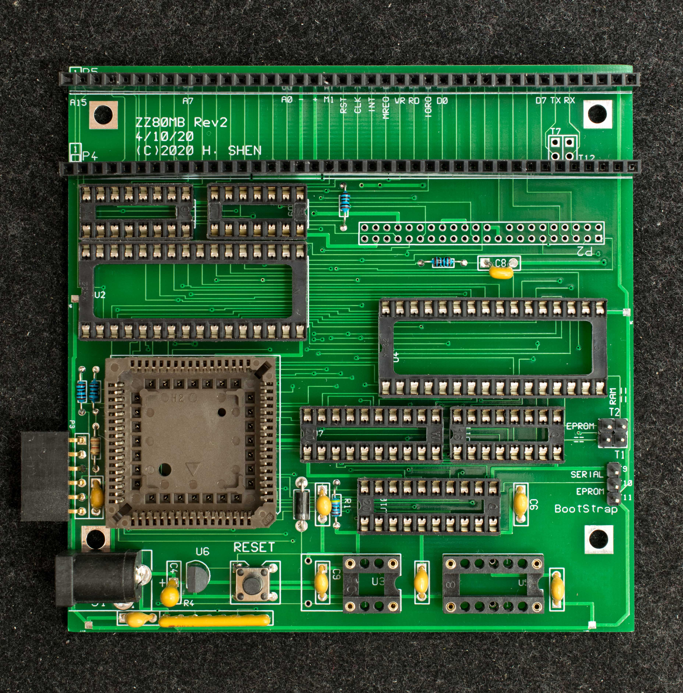
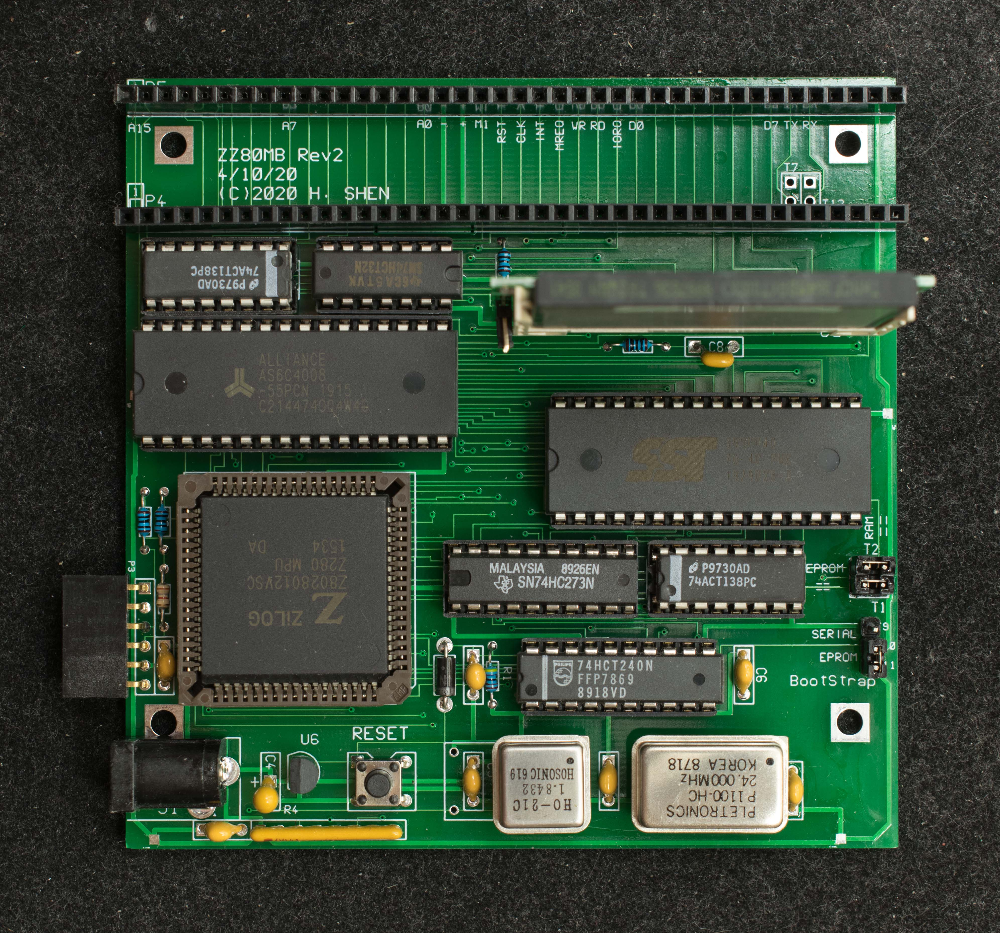

# ZZ80MB Rev2 Pictorial Assembly Guide

Bare PC board, component side

Bare PC board, solder side

Assemble the lowest height components first.

Assemble the resistors

Next assemble the capacitors

Install IC sockets

Install headers and bus connectors

Install remaining hardware except CF adapter

Install CF adapter last and populate the board with IC

