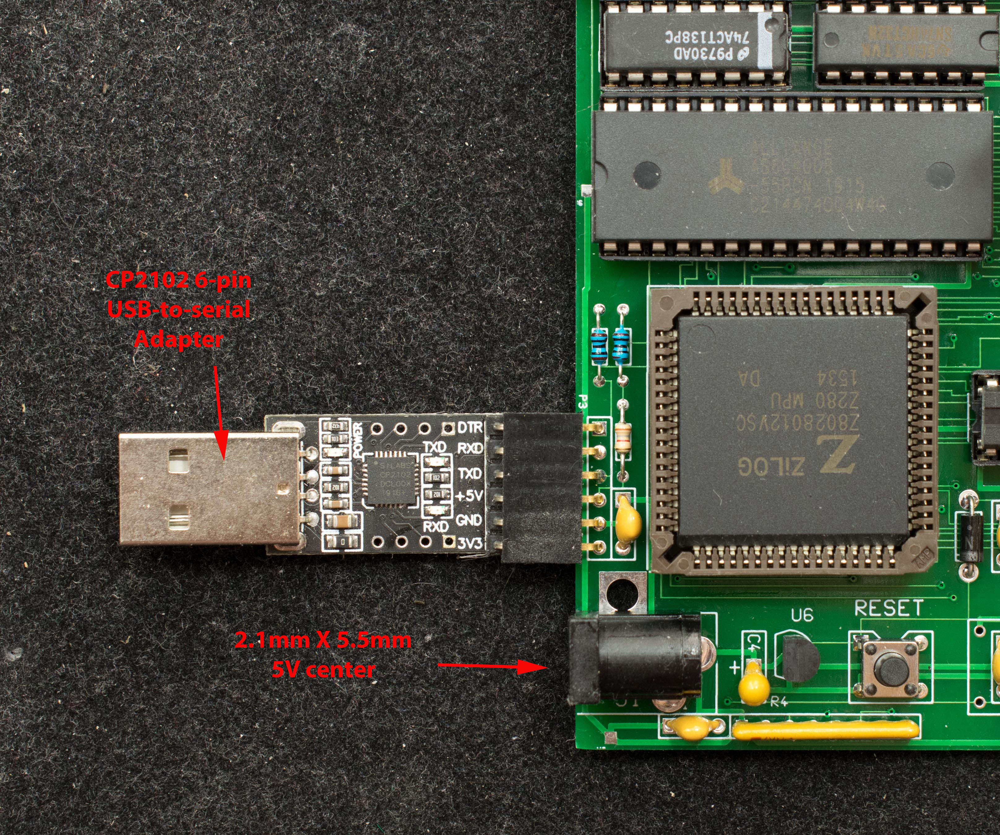
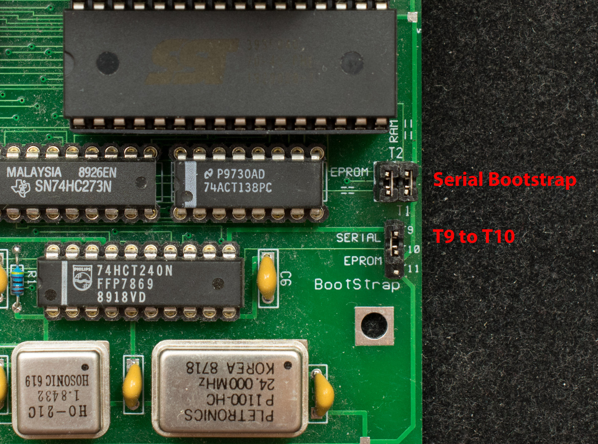
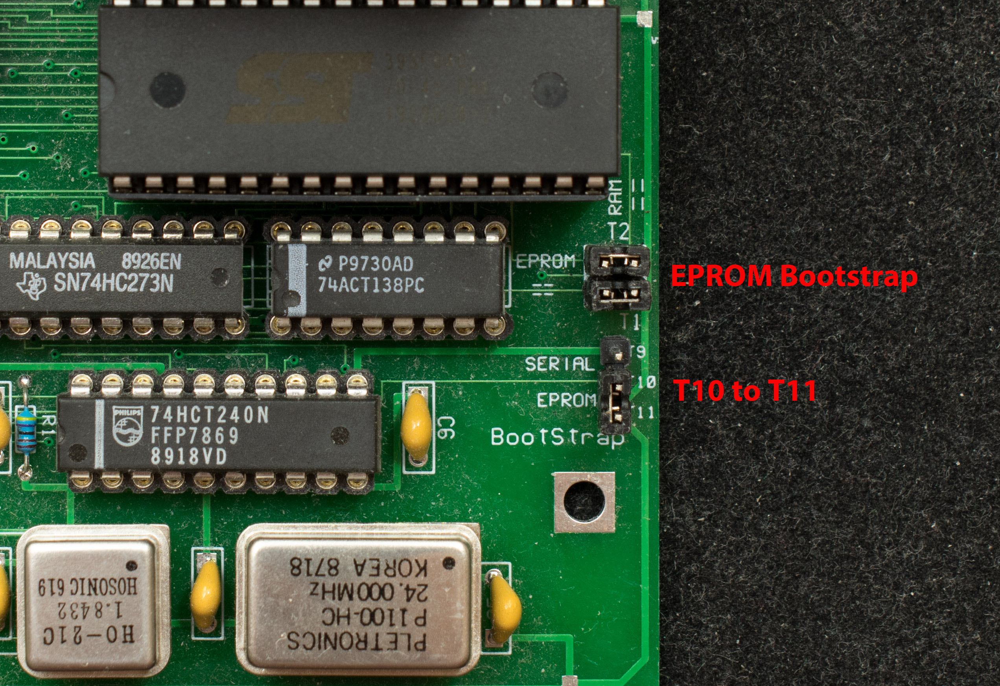

# Getting Started with ZZ80MB rev2
## Introduction
This guide assumes the assembly of rev2 of ZZ80MB is completed and components populated as shown in the last picture of ZZ80MB pictorial assembly guide. This guide shows how to program the EPROM and how to load software in the CF disk.

## Power up ZZ80MB
Picture below shows how ZZ80MB should be connected

## Programming the SST39F040 EPROM
Set jumper T1, T2, T9 and T10 as shown in Figure 1.

Set the terminal emulation parameters to 115200, Odd parity, 8 data bits and 1 stop bit. Power up ZZ80MB and send Tinyload.bin. Be sure to check the “Binary” box. The terminal will display the following message:

TinyLoad 1
G xxxx when done

Uncheck the “binary box” and leave it unchecked for the remaining operation; send progSST39F040.hex. When the load is completed, type “G 8000” ← upper case 'G', and 8000 will not echo back.

The following message will be displayed:

…………………………………………UX
G
ZZ80MB Programmer for SST39SF040 ver 0.1 10/1220
SST39SF040 will now be erased
Enter Y to proceed, all other keys to abort

Type 'Y' ←upper case 'Y' to erase SST39F040, then send 'ZZ80MBmon.hex'. The program is completed when “Programming is done” message is displayed. Below is a programming session as displayed on the terminal emulator.

TinyLoad 1
G xxxx when done
…………………………………………UX
G
ZZ80MB Programmer for SST39SF040 ver 0.1 10/1220
SST39SF040 will now be erased
Enter Y to proceed, all other keys to abort Y
SST39SF040 erased, ready to upload the image file
……………………………………………………………………………………………………………………………………………………………………….UX

Programming is done
## EPROM Bootstrap
Move jumper T1, T2, T10 and T11 as shown in Figure 2

Set the terminal emulation parameters to 115200, Odd parity, 8 data bits and 1 stop. Apply power and the following sign-on message should be displayed.

boot ZZ80MB Monitor v0.3 10/15/20
>

Type 'h' to display the menu. Refer to ZZ80MB monitor guide for explaination of monitor commands

>help G <addr> CR R <track> <sector> D <start addr> <end addr> I <port> O <value> <port> L <start addr> <end addr> Z CR F CR T CR E <addr> X <options> CR B <options> CR
C <options> CR

>

## Preparing a new CF disk for ZZ80MB
The following is step-by-step procedure for preparing a new CF disk for ZZ80MB. Note for Windows TeraTerm users, here is a ZZ80MB macro that will automatically install all software in a new CF disk.

### Initialize CF drives
The CF disk must be initialized before CP/M files can be stored. Use the monitor 'x' command to initialize CF disk:

type 'xA' followed by carriage return to initialize drive A ← note the drive letters must be in upper case.

type 'xB' followed by carriage return to initialize drive B

type 'xC' followed by carriage return to initialize drive C

type 'xD' followed by carriage return to initialize drive D

>x clear disk directories
A -- drive A,
B -- drive B:
C -- drive C,
D -- drive D,
A press Return to execute command>x clear disk directories

A -- drive A,
B -- drive B:
C -- drive C,
D -- drive D,
B press Return to execute command>x clear disk directories

A -- drive A,
B -- drive B:
C -- drive C,
D -- drive D,
C press Return to execute command>x clear disk directories

A -- drive A,
B -- drive B:
C -- drive C,
D -- drive D,
D press Return to execute command
### Install CP/M2.2 BDOS/CCP/BIOS
At ZZ80MB monitor command prompt, send 'cpm22all.hex' to ZZ80MB

type 'c2' to install CP/M2.2 BDOS/CCP/BIOS in reserved space in the CF disk

.........................................................................................................................................................................................................................................................................................................................................................................................................................UX>>copy to CF disk

1--User Apps,
2--CP/M2.2:
3--CP/M3: 2 press Return to execute command>
### Install XMODEM
Once the CP/M2.2 is installed, the first file to load in the CF disk is the file transfer program, XMODEM:

At ZZ80MB monitor command prompt, send XMODEM.HEX to ZZ80MB

type 'b2' to boot into CP/M2.2. The XMODEM image is in RAM memory, so

at CP/M prompt, type 'save 17 xmodem.com'. This will create a file named XMODEM.COM with size of 17 records.

....................................................................................................................................X//>>boot CP/M

1--User Apps,
2--CP/M2.2:
3--CP/M3: 2 press Return to execute command
Copyright 1979 (c) by Digital Research
CP/M 2.2 for ZZ80MB_rev2
12/15/20 4 external CF disks

a>save 17 xmodem.com
a>
### Install CP/M2.2 distribution files
Use XMODEM to load a decompression program, unarj.com:

At CP/M prompt, type 'xmodem unarj.com /r', and then open the workstation's xmodem menu and send unarj.com.

At CP/M prompt, type 'xmodem cpm22dri.arj /r' and open the workstation's xmodem menu and send cpm22dri.arj.

Assuming CP/M2.2 resides on drive B,

At CP/M prompt, type 'b:' to switch to drive B

At CP/M prompt, type 'a:unarj e a:cpm22dri' to decompress CP/M distribution files to drive B.

xmodem unarj.com /r

File created
Receiving via CON with CRCsCC
OK
Received 96 blocks
a>xmodem cpm22dri.arj /r

File created
Receiving via CON with CRCsCC
OK
Received 525 blocks
a>b:
b>a:unarj e a:cpm22dri

CPM-UNARJ 1.01 P.R.Hunt

 Archive: A:CPM22DRI.ARJ

File name
------------
Extracting: ASCIIART.TXT   OK
Extracting: ASM.COM   OK
Extracting: BIOS.ASM   OK
Extracting: CBIOS.ASM   OK
Extracting: DDT.COM   OK
Extracting: DEBLOCK.ASM   OK
Extracting: DISKDEF.LIB   OK
Extracting: DUMP.ASM   OK
Extracting: DUMP.COM   OK
Extracting: ED.COM   OK
Extracting: LOAD.COM   OK
Extracting: MBASIC80.COM   OK
Extracting: MOVCPM.COM   OK
Extracting: PIP.COM   OK
Extracting: STAT.COM   OK
Extracting: SUBMIT.COM   OK
Extracting: SYSGEN.COM   OK
Extracting: XMODEM.COM   OK
Extracting: XSUB.COM   OK

b>
### Install CP/M 3 and CP/M 3 distribution files
At ZZ80MB monitor prompt, send 'cpm3ldr.hex'

At ZZ80MB monitor prompt, type 'c3' to install CP/M3 loader to reserved space in the CF disk

At ZZ80MB monitor prompt, type 'b2' to boot up CP/M2.2

At CP/M prompt, type 'xmodem cpm3all.arj /r' and open the workstation's xmodem menu and send cpm3all.arj

At CP/M prompt, type 'unarj e cpm3all', this will install CP/M3 in drive A

Press reset to exit to ZZ80MB monitor,

At ZZ80MB monitor prompt, type 'b3' to boot into CP/M3

>.......................................................................................................................X>>copy to CF disk

1--User Apps,
2--CP/M2.2:
3--CP/M3: 3 press Return to execute command>boot CP/M

1--User Apps,
2--CP/M2.2:
3--CP/M3: 2 press Return to execute command
Copyright 1979 (c) by Digital Research
CP/M 2.2 for ZZ80MB_rev2
12/15/20 4 external CF disks

a>xmodem cpm3all.arj /r

File created
Receiving via CON with CRCsC
OK
Received 1822 blocks
a>unarj e cpm3all

CPM-UNARJ 1.01 P.R.Hunt

 Archive: CPM3ALL.ARJ

File name
------------
Extracting: BDOS3.SPR   OK
Extracting: BIOS3.SPR   OK
Extracting: BIOSKRNL.ASM   OK
Extracting: BNKBDOS3.SPR   OK
Extracting: BNKBIOS3.SPR   OK
Extracting: BNKBIOS3.SYM   OK
Extracting: BOOT.ASM   OK
Extracting: CALLVERS.ASM   OK
Extracting: CBIOS3.REL   OK
Extracting: CCP.COM   OK
Extracting: CHARIO.ASM   OK
Extracting: CMPLDR.COM   OK
Extracting: COPYSYS.ASM   OK
Extracting: COPYSYS.COM   OK
Extracting: CPM3.LIB   OK
Extracting: CPM3.SYS   OK
Extracting: CPMLDR.REL   OK
Extracting: DATE.COM   OK
Extracting: DEVICE.COM   OK
Extracting: DIR.COM   OK
Extracting: DIRLBL.RSX   OK
Extracting: DRVTBL.ASM   OK
Extracting: DUMP.ASM   OK
Extracting: DUMP.COM   OK
Extracting: ECHOVERS.ASM   OK
Extracting: ED.COM   OK
Extracting: ERASE.COM   OK
Extracting: FD1797SD.ASM   OK
Extracting: GENCOM.COM   OK
Extracting: GENCPM.COM   OK
Extracting: GET.COM   OK
Extracting: HELP.COM   OK
Extracting: HELP.HLP   OK
Extracting: HEXCOM.COM   OK
Extracting: HIST.UTL   OK
Extracting: INITDIR.COM   OK
Extracting: LDRBIOS.REL   OK
Extracting: LIB.COM   OK
Extracting: LINK.COM   OK
Extracting: MAC.COM   OK
Extracting: MODEBAUD.LIB   OK
Extracting: MOVE.ASM   OK
Extracting: PATCH.COM   OK
Extracting: PIP.COM   OK
Extracting: PORTS.LIB   OK
Extracting: PUT.COM   OK
Extracting: RANDOM.ASM   OK
Extracting: RENAME.COM   OK
Extracting: RESBDOS3.SPR   OK
Extracting: RMAC.COM   OK
Extracting: SAVE.COM   OK
Extracting: SCB.ASM   OK
Extracting: SCB.REL   OK
Extracting: SET.COM   OK
Extracting: SETDEF.COM   OK
Extracting: SHOW.COM   OK
Extracting: SID.COM   OK
Extracting: SUBMIT.COM   OK
Extracting: TRACE.UTL   OK
Extracting: TYPE.COM   OK
Extracting: XM.COM   OK
Extracting: XMODEM.COM   OK
Extracting: XREF.COM   OK

a>boot ZZ80MB Monitor v0.3 10/15/20>boot CP/M

1--User Apps,
2--CP/M2.2:
3--CP/M3: 3 press Return to execute command

Boot LDRBIOS for ZZ80RC

CP/M V3.0 Loader
Copyright (C) 1982, Digital Research

 BNKBIOS3 SPR  FA00  0600
 BNKBIOS3 SPR  B700  0900
 RESBDOS3 SPR  F400  0600
 BNKBDOS3 SPR  8900  2E00

 61K TPA
Copyright 1979 (c) by Digital Research
CP/M 3 for ZZ80MB_rev2 10/15/20
A>
### Install SCMonitor with built-in Startrek BASIC program
At ZZ80MB monitor prompt, send 'SCMonitor_startrek.hex'

At ZZ80MB monitor prompt, type 'c1', this will install SCMonitor to reserved space in the CF disk

At ZZ80MB monitor prompt, type 'b1' to boot into SCMonitor.

To run the built-in Startrek BASIC program,

At SCMonitor prompt, type 'wbasic' to warm boot BASIC

At BASIC prompt, type 'run', the StarTrek program will now run.

>....................................................................................................................................................................................................................................................................................................................................................................................................................................................................................................................................................................................................................................................................................................................................................................................................................................................................................................................................................................................................................................................................................................................................................................................................................................................................................................................................................................................................................................................................................................................................................................................................................................................................................................................................................................................................................................................................................................................................................................................................................................................................................................................................................................................................X
>copy to CF disk
1--User Apps,
2--CP/M2.2:
3--CP/M3: 1 press Return to execute command
>boot CP/M
1--User Apps,
2--CP/M2.2:
3--CP/M3: 1 press Return to execute command

Small Computer Monitor - RCZ280
*
