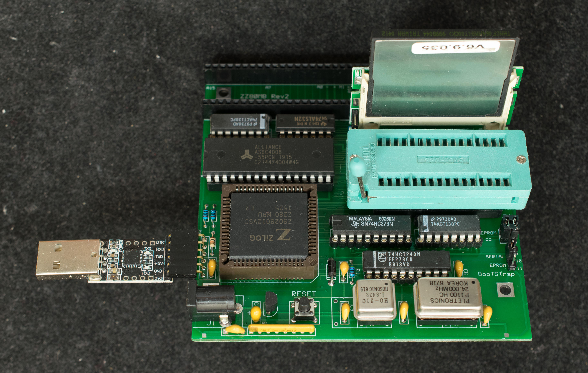
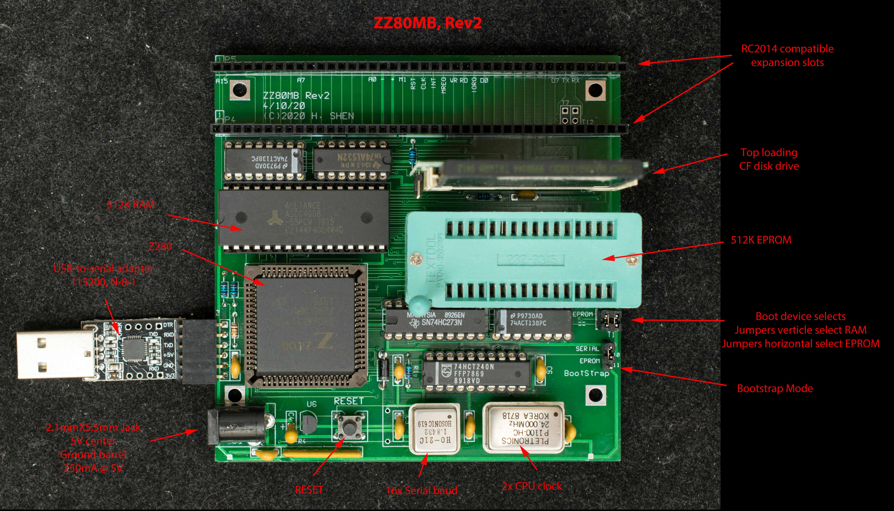

# ZZ80MB Rev2, A Z280-based SBC with RC2014 Expansion (Obsolete)
**Note, ZZ80MB rev2 is obsolete. There is a hardware error that cannot be easily corrected with an engineering change. It is replaced with [ZZ80MB rev3](../Rev3)**

### Design Information  (Obsoleted design, archival use only)
- [Schematic](zz80mb_r2_scm.pdf)
- [Gerber photoplots](zz80mb_rev2.zip)
- [Bill of Materials](zz80mb_rev2_bom.pdf)
