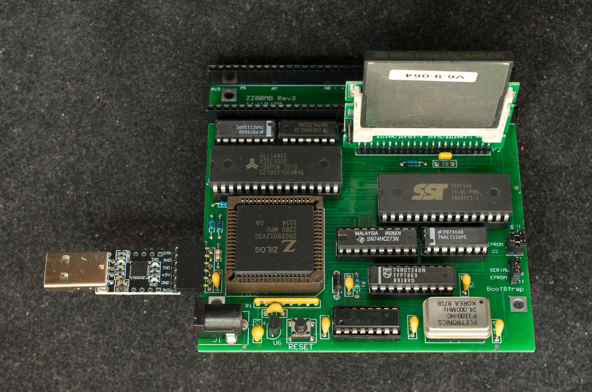
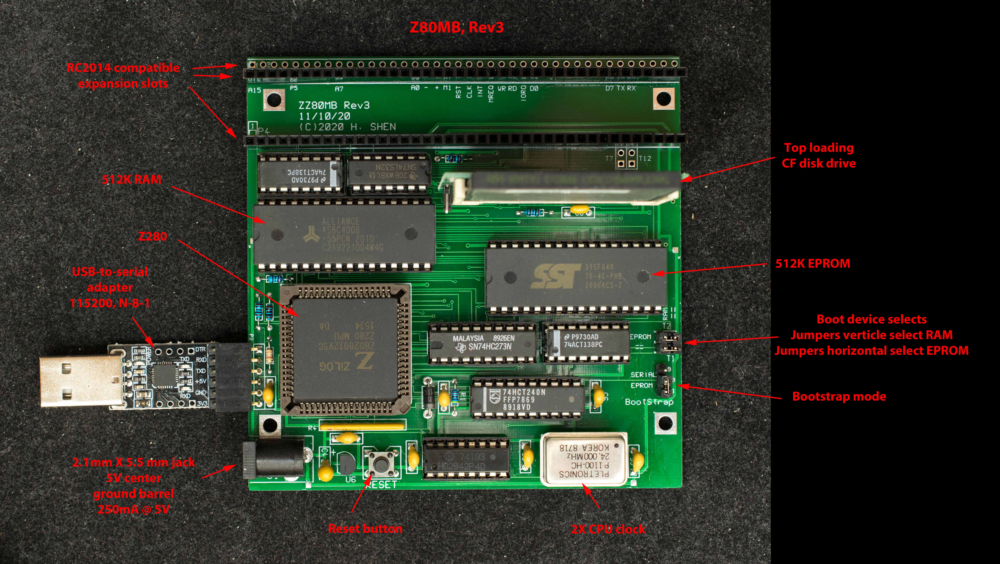
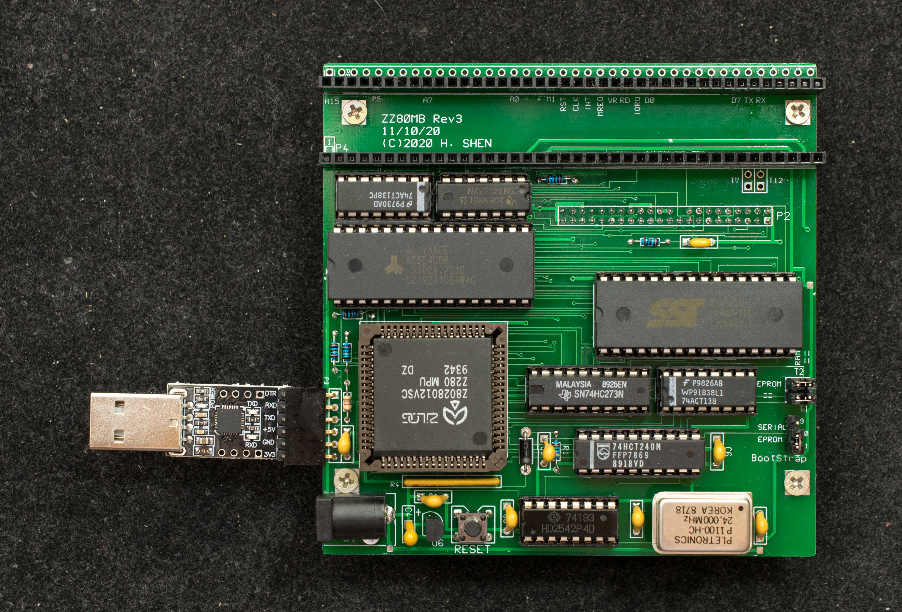
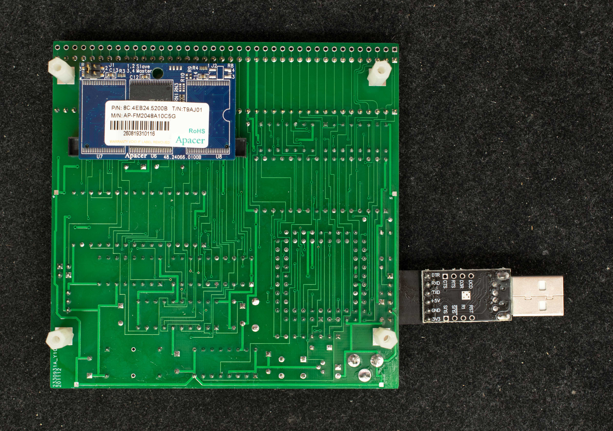

# ZZ80MB Rev3, A Z280-based SBC with RC2014 Expansion
Introduction
ZZ80MB is a Z280-based motherboard with RC2014 expansion slots. It is based on the ZZ80RC-CF design, but with two additional expansion slots added. ZZ80MB is designed with an EPROM programmer function such that it can boot from serial port, load EPROM programming image through the serial port and program an EPROM. This feature can be used to program EPROM for other computers. Rev3 corrected a Z280 hardware bug in [ZZ80MB rev2](../Rev2).

# Features
- Z280 CPU configured to Z80-compatible mode running at 24MHz with bus speed of 12 MHz
- 1/2 megbyte of RAM
- 1/2 megabyte of EPROM
- Two modes of operation,
  - Serial bootstrap mode, loading files from serial port,
  - EPROM bootstrap mode.
- CP/M 2.2 and CP/M 3 ready.
- CF interface supports 4 CF drives
- 3 RC2014 expansion slots
- One internal UART at 115200 baud, odd parity, no handshake
- bootstrap to ZZ80Mon, a simple monitor
- A standalone single-board computer with I/O expansion bus compatible with RC2014 I/O bus
- Economical 2-layer 102mm X 102mm pc board.

### Design Information
- [Schematic](zz80mb_r3_scm.pdf)
- [Gerber photo plots](zz80mb_rev3_gerber.zip)
- [Bill of materials](zz80mb_rev3_bom.pdf)

### Software
Prior to loading serial bootstrap loader and ZZ80MB monitor, set the serial emulation software to 115200, odd parity, 8 data, 1 stop. Set the jumpers on ZZ80MB to “RAM” position and Bootstrap to “Serial” position. **Note, the 115200 O81setting and RAM-Serial jumper positions are only for programming the flash; all subsequent software operate with 115200 N81 setting and EPROM bootstrap position.**

- [Serial bootstrap loader](Software/tinyload_no_clr_mem.zip), This is the 256-byte bootstrap as a raw binary file. It is received by ZZ80MB's UART and copied to RAM starting from location 0x0. If TeraTerm is the terminal software, check the 'Binary' box in 'Send file…' menu then send the file.
- [SST39F040 programmer](Software/progsst39f040_v0_1_release.zip), rev 0.1. This is the SST39F040 programmer. ZZ80MB is set to 'RAM' and 'Serial' bootstrap jumper positions. The terminal is set to 115200 odd parity. The serial bootstrap loader is loader first followed by progSST39F040. Issue the command 'G8000' (←'G' is upper case, '8000' will not echo back) to invoke progSST39F040. The program will prompt the user to erase SST39F040 and then load the hex file to be programmed.
- [ZZ80MB Monitor rev 0.5](Software/zz80monitor_rev0_5.zip) This is the program to be burn in the flash memory. Once EPROM is programmed, set the serial port to 115200, no parity, 8-data, 1-stop and set the jumpers on ZZ80MB to “EPROM” position and Bootstrap to “EPROM” position. This is the setting for normal operation.
- [CP/M2.2 BIOS/BDOS/CCP](Software/zz80rc_r1_cf_at_0x10_4_cfdrives.zip) CP/M2.2 executable tailored for ZZ80MB. It is loaded into memory with ZZ80CFMon, then use '**c2**' command to store it in CF disk and use '**b2**' command to boot into CP/M2.2.
- [SCMonitor with Startrek](Software/scmonitor_for_zz80mb_with_startrek.zip). This is Steve Cousin's SCMonitor ported to ZZ80MB. The popular StarTrek program is included. To invoke Startrek, type 'wbasic' at SCMonitor prompt, followed by 'run'. To save SCMonitor in CF disk, send scmonitor_startrek.hex to ZZ80MB, then type 'c1' to store it in CF disk. To run SCMonitor, type 'b1'.

### Manuals and Instructions
- Pictorial assembly guide for [ZZ80MB rev2](../Rev2/Manuals/Assembly_guide.md)
- Getting Started with ZZ80MB
- ZZ80MB Monitor Guide
- [Z280 Technical Manual](https://github.com/Plasmode/ZZRCC/blob/main/Manuals/z280_mpu_noocr_bw_400_.pdf)

### Alternative DOM Configuration
A disk-on-module (DOM) can be mounted on the bottom of the ZZ80MB as shown in the pictures below

Four standoffs are required to keep the DOM off the ground.
